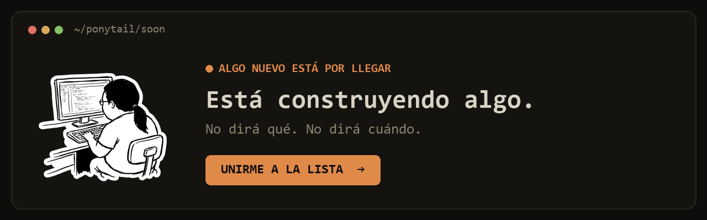

<p align="center">
  <picture>
    <source media="(prefers-color-scheme: dark)" srcset="assets/logo-dark.png">
    
  </picture>
</p>

<h1 align="center">Ponytail</h1>

<p align="center">
  <em>No dice nada. Escribe una línea. Funciona.</em>
</p>

<p align="center">
  
  
  
  
  
</p>

<p align="center">
  <a href="https://trendshift.io/repositories/50668" target="_blank" rel="noopener noreferrer"></a>
  <a href="https://trendshift.io/repositories/50668" target="_blank" rel="noopener noreferrer"></a>
</p>

<p align="center">
  <strong>~54% menos código (hasta 94%) &middot; ~20% más barato &middot; ~27% más rápido &middot; 100% seguro</strong><br>
  <sub>Medido en sesiones reales de Claude Code editando un repo open-source real (FastAPI + React), contra el mismo agente sin skill. ~54% es el promedio de 12 tareas de feature (Haiku 4.5, n=4); llega al 94% cuando un agente sobre-construye (un selector de fechas) y es casi cero cuando el código ya es mínimo. ponytail mantiene cada guarda de seguridad, mientras que un prompt pelado de "escribe one-liners" se salta una. (El benchmark anterior de un solo disparo reportaba 80-94% como cifra plana; contra un baseline agéntico justo, ese es el techo por tarea, no el promedio.) <a href="benchmarks/results/2026-06-18-agentic.md">Reporte completo</a> &middot; <a href="benchmarks/">reprodúcelo</a>.</sub>
</p>

<p align="center">
  <sub>Traducción de la comunidad. La versión de referencia y más reciente es el <a href="README.md">README en inglés</a>.</sub>
</p>

---

<p align="center">
  <a href="https://ponytail.dev/soon"></a>
</p>

Lo conoces. Cola de caballo larga. Lentes ovalados. Lleva más tiempo en la empresa que el control de versiones. Le muestras cincuenta líneas; las mira, no dice nada, y las reemplaza por una.

Ponytail lo pone dentro de tu agente de IA.

## Antes / después

Le pides un selector de fechas. Tu agente instala flatpickr, escribe un componente wrapper, agrega un stylesheet, y empieza una discusión sobre zonas horarias.

Con ponytail:

```html
<!-- ponytail: el browser ya tiene uno -->
<input type="date">
```

Más sobrevivientes en [examples/](examples/).

## Números

La medición honesta es un agente real haciendo trabajo real: una sesión headless de Claude Code editando [el template full-stack-fastapi de tiangolo](https://github.com/fastapi/full-stack-fastapi-template) (un repo real de FastAPI + React), evaluada sobre el `git diff` que deja. Doce tickets de feature, el mismo agente con y sin el skill, n=4, Haiku 4.5.

<p align="center">
  
</p>

| vs baseline sin skill | LOC | tokens | costo | tiempo | seguro |
|---|--:|--:|--:|--:|--:|
| **ponytail** | **-54%** | **-22%** | **-20%** | **-27%** | **100%** |
| caveman (control de prosa concisa) | -20% | +7% | +3% | +2% | 100% |
| prompt "YAGNI + one-liners" | -33% | -14% | -21% | -30% | 95% |

ponytail es la única variante que recorta cada métrica, y la única que se mantiene totalmente segura al hacerlo. El recorte es mayor donde hay una trampa real de sobre-construcción (selector de fechas de 404 a 23 líneas, selector de color de 287 a 23, porque usa un `<input>` nativo en vez de un componente) y casi cero en código que ya es mínimo. Método completo, tablas por tarea y limitaciones: [benchmarks/results/2026-06-18-agentic.md](benchmarks/results/2026-06-18-agentic.md).

<details>
<summary><strong>Números anteriores de un solo disparo (generación aislada)</strong></summary>

Cinco tareas del día a día, tres modelos, tres variantes (sin skill, [caveman](https://github.com/JuliusBrussee/caveman), ponytail), diez ejecuciones, mediana reportada. Un prompt, una completación, contando las líneas de la respuesta:

<p align="center">
  
</p>

Esto mostraba **80-94% menos código**. [#126](https://github.com/DietrichGebert/ponytail/issues/126) señaló con razón que el baseline del modelo pelado infla su respuesta con prosa y opciones, así que esa diferencia es en parte un artefacto del baseline conversacional. Los números agénticos de arriba son la versión corregida y defendible. Reproduce la corrida de un solo disparo con `npx promptfoo eval -c benchmarks/promptfooconfig.yaml`.

</details>

**La regla nunca fue "menos tokens."** Es: escribe solo lo que la tarea necesita, y nunca recortes validación, manejo de errores, seguridad ni accesibilidad. El código termina pequeño porque es necesario, no por golf. El menor costo y latencia son un efecto secundario en los modelos que siguen la escalera; un modelo de razonamiento conciso que gasta tokens de pensamiento deliberando los peldaños puede ir al revés (en GPT-5.5 lo hace).

## Cómo funciona

Antes de escribir código, el agente se detiene en el primer peldaño que aguanta:

```
1. ¿Necesita existir esto?        → no: omitirlo (YAGNI)
2. ¿Ya existe en este código?     → reúsalo, no lo reescribas
3. ¿Lo hace la stdlib?            → úsala
4. ¿Es una feature nativa?        → úsala
5. ¿Una dependencia ya instalada? → úsala
6. ¿Cabe en una línea?            → una línea
7. Solo entonces: el mínimo que funciona
```

La escalera se recorre *después* de entender el problema, no en su lugar: lee el código que toca el cambio y sigue el flujo real antes de elegir un peldaño. Flojo en la solución, nunca en la lectura.

Flojo, no negligente: la validación en límites de confianza, el manejo de pérdida de datos, la seguridad y la accesibilidad nunca están en riesgo.

## Instalación

El mayor esfuerzo que ponytail te va a pedir:

Los plugins de Claude Code y Codex ejecutan dos pequeños lifecycle hooks de Node.js, así que `node` debe estar en tu PATH (nota para usuarios de Nix/nvm: debe estar en el PATH del shell no-interactivo). Si no lo está, los skills igualmente funcionan, la activación automática simplemente queda en silencio en vez de lanzar un error en cada prompt.

### Claude Code

```
/plugin marketplace add DietrichGebert/ponytail
/plugin install ponytail@ponytail
```

La app de escritorio no tiene el comando `/plugin`. Instálala desde la interfaz: Customize, el + junto a los plugins personales, Create plugin and add marketplace, Add from repository, y luego ingresa la URL del repo (gracias @NiklasDHahn, #98).

### Codex

```bash
codex plugin marketplace add DietrichGebert/ponytail
codex
```

Abre `/plugins`, selecciona el marketplace de Ponytail e instala Ponytail. Luego abre `/hooks`, revisa y autoriza sus dos lifecycle hooks, y empieza un nuevo hilo.

Esta misma instalación cubre también la app de escritorio de Codex: reinicia la app después de instalar y detecta el plugin automáticamente.

### GitHub Copilot CLI

```bash
copilot plugin marketplace add DietrichGebert/ponytail
copilot plugin install ponytail@ponytail
```

En una sesión interactiva de Copilot CLI, usa los equivalentes con slash:

```
/plugin marketplace add DietrichGebert/ponytail
/plugin install ponytail@ponytail
```

Copilot CLI agrupa los comandos del plugin bajo el nombre del plugin. Por ejemplo:

```text
/ponytail:ponytail ultra
/ponytail:ponytail-review
```

### Pi agent harness

```
pi install git:github.com/DietrichGebert/ponytail
```

### OpenCode

Agrega esto a `opencode.json`:

```json
{ "plugin": ["@dietrichgebert/ponytail"] }
```

O ejecútalo desde un checkout (el plugin reutiliza sus `hooks/` y `skills/`):

```json
{ "plugin": ["./.opencode/plugins/ponytail.mjs"] }
```

Inyecta el ruleset en cada turno con el nivel activo; agrega los comandos `/ponytail` (ver [Comandos](#comandos)). OpenCode también carga automáticamente el `AGENTS.md` de este repo, así que las reglas aplican incluso sin el plugin. El plugin agrega los niveles `lite/full/ultra/off`.

El path `./` se resuelve contra el `opencode.json` de tu proyecto; para compartir un único checkout entre proyectos, apunta al path absoluto del `.mjs` (encuentra sus `hooks/` y `skills/` relativo a su propio archivo).

### Gemini CLI

```bash
gemini extensions install https://github.com/DietrichGebert/ponytail
```

Carga el ruleset como contexto permanente en cada sesión y registra los comandos `/ponytail`; los `skills/` también se incluyen, activados cuando una tarea los necesita.

### Antigravity CLI

Google está renombrando Gemini CLI a Antigravity CLI (el binario `agy`); la misma extensión se instala ahí:

```bash
agy plugin install https://github.com/DietrichGebert/ponytail
```

Reutiliza el `gemini-extension.json` de este repo. Una diferencia: Antigravity convierte los comandos `/ponytail` en skills, así que los escribes en el chat (por ejemplo `/ponytail-review` como mensaje) en vez de seleccionarlos de un menú slash. Hasta que la migración se complete (alrededor del 18 de junio de 2026), `gemini extensions install` también funciona. Para usarlo como regla permanente, coloca el ruleset en `.agents/rules/`.

### CodeWhale

Lee `AGENTS.md` desde la raíz del proyecto, sin configuración. Copia [`AGENTS.md`](AGENTS.md) a tu proyecto, o ejecuta `codewhale` desde un checkout de este repo. Eso es todo.

### OpenClaw

```bash
clawhub install ponytail
```

Instala ponytail como skill de OpenClaw desde ClawHub; los skills de review, audit, debt y help se instalan igual (`clawhub install ponytail-review`, etc.). OpenClaw lo aplica en tareas de código y también lo expone como comando `/ponytail`. Sin ClawHub, copia [`.openclaw/skills/ponytail`](.openclaw/skills/) a `~/.openclaw/skills/`.

Eso fue todo. Él estaría orgulloso. No lo va a decir.

Activo en cada sesión, con un puñado de comandos (ver [Comandos](#comandos)). `/ponytail ultra` existe para cuando el codebase te hizo algo personal. El texto de inicio y de cambio de modo muestra el nivel activo.

Configura el nivel para cada nueva sesión con la variable de entorno `PONYTAIL_DEFAULT_MODE` (`lite`/`full`/`ultra`/`off`), o con un campo `defaultMode` en `~/.config/ponytail/config.json` (`%APPDATA%\ponytail\config.json` en Windows). El default es `full`.

Cursor, Windsurf, Cline, GitHub Copilot (editor), Aider, Kiro: copia el archivo de reglas correspondiente de este repo ([`.cursor/rules/`](.cursor/rules/), [`.windsurf/rules/`](.windsurf/rules/), [`.clinerules/`](.clinerules/), [`.github/copilot-instructions.md`](.github/copilot-instructions.md), [`AGENTS.md`](AGENTS.md), [`.kiro/steering/`](.kiro/steering/)).

Kiro: copia `.kiro/steering/ponytail.md` a `~/.kiro/steering/` (global) o `.kiro/steering/` en tu proyecto.

Fallback de GitHub Copilot CLI (modo solo instrucciones): lee `AGENTS.md` y `.github/copilot-instructions.md` en un proyecto, o copia las reglas a `~/.copilot/copilot-instructions.md` para ejecutar ponytail en todos tus proyectos. Esta vía mantiene la guía permanente, pero no agrega switches de modo ni hooks.

VS Code con la extensión Codex lee `AGENTS.md`, que este repo incluye, así que funciona desde la raíz del repo sin configuración adicional (`~/.codex/AGENTS.md` hace a Codex global).

Qué archivos corresponden a qué agente: [Portabilidad de agentes](docs/agent-portability.md).

## Comandos

| Comando | Qué hace |
|---------|----------|
| `/ponytail [lite \| full \| ultra \| off]` | Cambia la intensidad, o apágalo. Sin argumento, reporta el nivel actual. |
| `/ponytail-review` | Revisa el diff actual en busca de sobre-ingeniería y devuelve una lista de qué eliminar. |
| `/ponytail-audit` | Audita el repo completo en busca de sobre-ingeniería, no solo el diff. |
| `/ponytail-debt` | Recolecta los atajos marcados con `ponytail:` que dejaste pendientes en un registro, para que "después" no se convierta en "nunca". |
| `/ponytail-help` | Referencia rápida de los comandos anteriores. |

Los comandos requieren un host compatible con skills (Claude Code, Codex, OpenCode, Gemini, pi). En Codex son skills; se invocan con `@` (`@ponytail-review`). Los adaptadores de solo instrucciones (Cursor, Windsurf, Cline, Copilot, Kiro, Antigravity) cargan el ruleset permanente sin los comandos.

## Desarrollo

Al cambiar el texto compacto de las reglas, mantén alineadas las copias en los adaptadores:

```bash
node scripts/check-rule-copies.js
npm test
```

El paquete de skills de OpenClaw (`.openclaw/skills/`) se genera desde `skills/`; ejecuta `node scripts/build-openclaw-skills.js` después de cambiar un skill, la suite de tests falla si está desactualizado.

El benchmark de correctness lanza Python para las verificaciones de email y CSV; se prueba `python3` antes que `python`. Las verificaciones de CSV requieren `pandas` instalado localmente.

## FAQ

**¿Necesita un archivo de configuración?**
No. Un opcional `~/.config/ponytail/config.json` o la variable `PONYTAIL_DEFAULT_MODE` pueden fijar el nivel default, pero nada es obligatorio.

**¿Y si realmente necesito la clase de caché de 120 líneas?**
No la necesitas. Insiste de todas formas y él la va a construir. Despacio. Correctamente. Mirándote.

**¿Escala?**
El código que nunca escribiste escala infinitamente. Cero bugs, cero CVEs, 100% uptime desde siempre.

**¿Por qué "ponytail"?**
Ya sabes exactamente por qué.

## Licencia

[MIT](LICENSE). La licencia más corta que funciona.

## Historial de estrellas

<a href="https://www.star-history.com/dietrichgebert/ponytail#history">
 <picture>
   <source media="(prefers-color-scheme: dark)" srcset="https://api.star-history.com/chart?repos=DietrichGebert/ponytail&type=Date&theme=dark" />
   <source media="(prefers-color-scheme: light)" srcset="https://api.star-history.com/chart?repos=DietrichGebert/ponytail&type=Date" />
   
 </picture>
</a>
