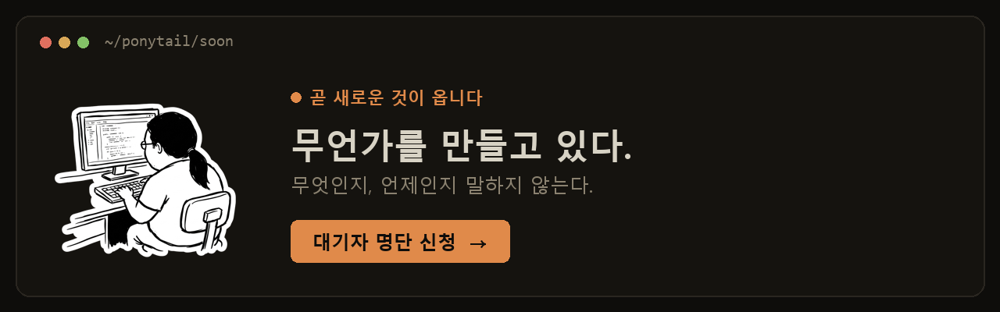

<p align="center">
  <picture>
    <source media="(prefers-color-scheme: dark)" srcset="assets/logo-dark.png">
    
  </picture>
</p>

<h1 align="center">Ponytail</h1>

<p align="center">
  <em>말이 없다. 한 줄을 쓴다. 돌아간다.</em>
</p>

<p align="center">
  
  
  
  
  
</p>

<p align="center">
  <a href="https://trendshift.io/repositories/50668" target="_blank" rel="noopener noreferrer"></a>
  <a href="https://trendshift.io/repositories/50668" target="_blank" rel="noopener noreferrer"></a>
</p>

<p align="center">
  <strong>코드 약 54% 감소(최대 94%) &middot; 약 20% 저렴 &middot; 약 27% 빠름 &middot; 100% 안전</strong><br>
  <sub>실제 오픈소스 저장소(FastAPI + React)를 고치는 실제 Claude Code 세션에서, 스킬을 끈 같은 에이전트와 견줘 측정했다. 약 54%는 기능 작업 12건의 평균이다(Haiku 4.5, n=4). 에이전트가 과하게 짤 여지가 있는 곳(날짜 선택기)에선 94%까지 오르고, 코드가 이미 최소한인 곳에선 0에 가깝다. ponytail은 안전 가드를 하나도 빼놓지 않지만, 그냥 "한 줄로 써"라고만 시킨 프롬프트는 그중 하나를 놓친다. (예전 단발성 벤치마크는 80-94%를 단일 수치로 내세웠는데, 공정한 에이전트 기준선에 견주면 그건 평균이 아니라 작업별 상한이다.) <a href="benchmarks/results/2026-06-18-agentic.md">전체 보고서</a> &middot; <a href="benchmarks/">직접 재현하기</a>.</sub>
</p>

<p align="center">
  <sub>커뮤니티 번역이다. 기준이 되는 최신 버전은 <a href="README.md">영어 README</a>다.</sub>
</p>

---

<p align="center">
  <a href="https://ponytail.dev/soon"></a>
</p>

이런 사람, 다들 알 거다. 긴 포니테일에 타원형 안경. 버전 관리 시스템보다 회사에 오래 있었다. 코드 쉰 줄을 들이밀면 잠깐 보더니, 말없이 한 줄로 바꿔 놓는다.

Ponytail은 그를 당신의 AI 에이전트 안에 앉혀 둔다.

## Before / after

날짜 선택기 하나 만들어 달라고 한다. 에이전트는 flatpickr를 깔고, 래퍼 컴포넌트를 짜고, 스타일시트를 붙이더니, 타임존 얘기를 꺼내기 시작한다.

ponytail이라면:

```html
<!-- ponytail: browser has one -->
<input type="date">
```

살아남은 것들이 더 궁금하다면 [examples/](examples/)로.

## Numbers

공정하게 재려면 실제 에이전트에게 실질적인 작업을 시켜 봐야 한다. 헤드리스 Claude Code 세션에게 [tiangolo의 full-stack-fastapi-template](https://github.com/fastapi/full-stack-fastapi-template)(진짜 FastAPI + React 저장소)을 맡기고, 남긴 `git diff`로 점수를 매겼다. 기능 티켓 12건, 같은 에이전트를 스킬만 켜고 끄며 비교, n=4, Haiku 4.5.

<p align="center">
  
</p>

| 스킬 없는 기준선 대비 | LOC | tokens | cost | time | safe |
|---|--:|--:|--:|--:|--:|
| **ponytail** | **-54%** | **-22%** | **-20%** | **-27%** | **100%** |
| caveman (간결한 산문 대조군) | -20% | +7% | +3% | +2% | 100% |
| "YAGNI + one-liners" 프롬프트 | -33% | -14% | -21% | -30% | 95% |

모든 지표를 깎은 건 ponytail뿐이고, 그러면서 안전까지 온전히 지킨 것도 ponytail뿐이다. 깎이는 폭은 과잉 구현의 함정이 실제로 있는 곳에서 가장 크다. 컴포넌트 대신 네이티브 `<input>`으로 손이 가니 날짜 선택기는 404줄에서 23줄로, 색상 선택기는 287줄에서 23줄로 줄어든다. 반대로 이미 군더더기 없는 코드에선 거의 0이다. 전체 방법론, 작업별 표, 한계는 [benchmarks/results/2026-06-18-agentic.md](benchmarks/results/2026-06-18-agentic.md)에 있다.

<details>
<summary><strong>예전 단발성 수치 (격리된 생성)</strong></summary>

일상적인 작업 다섯 가지, 모델 셋, 비교군 셋(스킬 없음, [caveman](https://github.com/JuliusBrussee/caveman), ponytail), 10회 실행, 중앙값 기준. 프롬프트 하나에 응답 하나, 답변의 줄 수를 셌다:

<p align="center">
  
</p>

여기선 **코드 80-94% 감소**가 나왔다. 다만 [#126](https://github.com/DietrichGebert/ponytail/issues/126)이 맞게 짚었듯, 스킬을 전혀 안 붙인 기준선 모델은 답변을 설명과 선택지로 부풀린다. 그래서 그 격차의 일부는 대화형 기준선이 만들어 낸 착시다. 위의 에이전트 수치가 그걸 바로잡은, 근거 있는 버전이다. 단발성 실행은 `npx promptfoo eval -c benchmarks/promptfooconfig.yaml`로 재현할 수 있다.

</details>

**규칙은 애초에 "토큰 최소화"가 아니었다.** 작업에 필요한 만큼만 쓰되, 검증·에러 처리·보안·접근성은 절대 덜어내지 않는다는 것이다. 코드가 작아지는 건 억지로 줄여서가 아니라 딱 그만큼만 필요해서다. 비용과 지연이 낮아지는 것도 단계를 충실히 밟는 모델에서나 부수적으로 딸려 오는 효과일 뿐이다. 그 단계를 고민하느라 사고 토큰을 쏟는 간결한 추론 모델은 오히려 거꾸로 갈 수도 있다(GPT-5.5가 그렇다).

## How it works

코드를 쓰기 전에, 에이전트는 가장 먼저 들어맞는 단계에서 멈춘다:

```
1. 이게 있을 필요가 있나?      → 없다: 건너뛴다 (YAGNI)
2. 이미 이 코드베이스에 있나?  → 다시 짜지 말고 가져다 쓴다
3. 표준 라이브러리로 되나?     → 쓴다
4. 네이티브 플랫폼 기능인가?   → 쓴다
5. 깔려 있는 의존성이 푸나?    → 쓴다
6. 한 줄로 되나?               → 한 줄
7. 그제서야: 돌아가는 최소한
```

단계를 밟는 건 문제를 이해한 *다음*이지, 이해를 대신하는 게 아니다. 변경이 닿는 코드를 읽고 실제 흐름을 따라가 본 뒤에야 단계를 고른다. 해법에는 게을러도, 읽는 데는 절대 게으르지 않다.

게으른 거지 부주의한 게 아니다. 신뢰 경계의 검증, 데이터 손실 방지, 보안, 접근성은 결코 잘려 나가지 않는다.

## Install

ponytail이 당신에게 요구할 수고의 최대치:

Claude Code와 Codex 플러그인은 자그마한 Node.js 라이프사이클 훅 두 개를 돌리니, `node`가 PATH에 잡혀 있어야 한다(Nix/nvm 사용자라면 비대화형 셸의 PATH에 있어야 한다). 없어도 스킬은 멀쩡히 돌아간다. 다만 늘 켜져 있던 자동 활성화가 매 프롬프트마다 에러를 뱉는 대신 조용히 비활성으로 남을 뿐이다.

### Claude Code

```
/plugin marketplace add DietrichGebert/ponytail
```
```
/plugin install ponytail@ponytail
```
(설치가 되려면 두 프롬프트를 따로 보내야 한다)

데스크톱 앱에는 `/plugin` 명령이 없다. 대신 UI에서 설치한다: Customize, 개인 플러그인 옆의 +, Create plugin and add marketplace, Add from repository, 그다음 저장소 URL 입력(감사합니다 @NiklasDHahn, #98).

### Codex

```bash
codex plugin marketplace add DietrichGebert/ponytail
codex
```

`/plugins`를 열어 Ponytail 마켓플레이스를 고르고 Ponytail을 설치한다. 그런 다음
`/hooks`를 열어 라이프사이클 훅 두 개를 검토하고 신뢰한 뒤, 새 스레드를 시작한다.

이 설치 한 번이면 Codex 데스크톱 앱도 같이 잡힌다. 설치 후 앱을 다시 켜면 플러그인을 알아챈다.

### GitHub Copilot CLI

```bash
copilot plugin marketplace add DietrichGebert/ponytail
copilot plugin install ponytail@ponytail
```

대화형 Copilot CLI 세션에서는 슬래시 명령으로 똑같이 하면 된다:

```
/plugin marketplace add DietrichGebert/ponytail
/plugin install ponytail@ponytail
```

Copilot CLI는 플러그인 명령에 그 이름을 네임스페이스로 붙인다. 예를 들면:

```text
/ponytail:ponytail ultra
/ponytail:ponytail-review
```

### Pi agent harness

```
pi install git:github.com/DietrichGebert/ponytail
```

### OpenCode

`opencode.json`에 다음을 더한다:

```json
{ "plugin": ["@dietrichgebert/ponytail"] }
```

체크아웃에서 직접 돌려도 된다(플러그인이 `hooks/`와 `skills/`를 그대로 쓴다):

```json
{ "plugin": ["./.opencode/plugins/ponytail.mjs"] }
```

매 턴마다 지금 레벨의 룰셋을 주입하고, `/ponytail` 명령들을 붙여 준다([Commands](#commands) 참고). OpenCode는 이 저장소의 `AGENTS.md`도 알아서 불러오니, 플러그인이 없어도 규칙은 살아 있다. 플러그인은 `lite/full/ultra/off` 레벨을 얹어 준다.

`./` 경로는 프로젝트의 `opencode.json`을 기준으로 풀린다. 체크아웃 하나를 여러 프로젝트에서 같이 쓰려면, 대신 `.mjs`의 절대 경로를 가리키면 된다(그 파일은 제 위치를 기준으로 `hooks/`와 `skills/`를 찾는다).

### Gemini CLI

```bash
gemini extensions install https://github.com/DietrichGebert/ponytail
```

매 세션 룰셋을 늘 켜진 컨텍스트로 불러오고 `/ponytail` 명령들을 등록한다. `skills/`도 함께 실리며, 작업에 필요할 때 켜진다.
Gemini 어댑터는 일부러 루트 `hooks/hooks.json`을 두지 않는다. Gemini는 그 경로를 자동으로 불러오는데, ponytail의 라이프사이클 훅은 Claude/Codex 이벤트 이름을 쓰기 때문이다.

### Antigravity CLI

Google이 Gemini CLI를 Antigravity CLI(`agy` 바이너리)로 이름을 바꾸는 중인데, 같은 확장이 거기에도 설치된다:

```bash
agy plugin install https://github.com/DietrichGebert/ponytail
```

이 저장소의 `gemini-extension.json`을 그대로 재사용한다. 차이는 하나다. Antigravity는 `/ponytail` 명령들을 스킬로 바꿔 버려서, 슬래시 메뉴에서 고르는 대신 채팅에 직접 친다(예: `/ponytail-review`를 메시지로). 전환이 마무리될 때까지(2026년 6월 18일경)는 `gemini extensions install`도 여전히 먹힌다. 늘 켜진 규칙으로 돌리고 싶으면, 룰셋을 `.agents/rules/`에 넣으면 된다.

### CodeWhale

프로젝트 루트의 `AGENTS.md`를 읽고, 설정은 전혀 필요 없다. [`AGENTS.md`](AGENTS.md)를 프로젝트에 복사하거나, 이 저장소를 체크아웃한 곳에서 `codewhale`을 돌리면 된다. 그게 끝이다.

### Swival

먼저 컬렉션을 라이브러리에 스테이징한 다음, 원하는 스킬을 더한다:

```bash
swival skills add --global https://github.com/DietrichGebert/ponytail  # ~/.config/swival/library에 스테이징
swival skills add ponytail                                             # 이 프로젝트에 컬렉션 설치
swival skills add --global ponytail                                    # 또는 모든 프로젝트에서 켜기
```

Swival도 프로젝트 루트의 `AGENTS.md`와 전역의 `~/.config/swival/AGENTS.md`를 읽는다. 지시문 전용 폴백이다.

명령줄에서는 `$` 접두사로 스킬을 명시적으로 켠다. 예: `$ponytail-review`.

### OpenClaw

```bash
clawhub install ponytail
```

ClawHub에서 ponytail을 OpenClaw 스킬로 설치한다. review, audit, debt, gain, help 스킬도 같은 식으로 깐다(`clawhub install ponytail-review` 등). OpenClaw는 코딩 작업에 이를 적용하고 `/ponytail` 명령으로도 열어 준다. ClawHub가 없으면 [`.openclaw/skills/ponytail`](.openclaw/skills/)을 `~/.openclaw/skills/`에 복사하면 된다.

이게 끝이었다. 그 사람이라면 흐뭇해할 거다. 입 밖으로 내진 않겠지만.

매 세션 켜져 있고, 명령 몇 개가 딸려 온다([Commands](#commands) 참고). `/ponytail ultra`는 코드베이스가 당신에게 단단히 밉보인 날을 위해 있다. 시작할 때와 모드를 바꿀 때 지금 모드를 보여 준다.

새 세션마다 적용할 레벨은 `PONYTAIL_DEFAULT_MODE` 환경 변수(`lite`/`full`/`ultra`/`off`)로, 또는 `~/.config/ponytail/config.json`의 `defaultMode` 필드(Windows에선 `%APPDATA%\ponytail\config.json`)로 정한다. 기본값은 `full`이다.

Cursor, Windsurf, Cline, GitHub Copilot(에디터), Aider, Kiro, Zed, CodeWhale: 이 저장소에서 맞는 규칙 파일을 복사하면 된다([`.cursor/rules/`](.cursor/rules/), [`.windsurf/rules/`](.windsurf/rules/), [`.clinerules/`](.clinerules/), [`.github/copilot-instructions.md`](.github/copilot-instructions.md), [`AGENTS.md`](AGENTS.md), [`.kiro/steering/`](.kiro/steering/)).

Kiro: `.kiro/steering/ponytail.md`를 `~/.kiro/steering/`(전역)이나 프로젝트의 `.kiro/steering/`에 복사한다.

GitHub Copilot CLI 폴백(지시문 전용 모드): 프로젝트의 `AGENTS.md`와 `.github/copilot-instructions.md`를 읽거나, 모든 프로젝트에서 ponytail을 돌리려면 규칙을 `~/.copilot/copilot-instructions.md`에 복사한다. 이 경로는 늘 켜진 가이드는 살리지만, 플러그인 모드 전환이나 훅은 더해 주지 않는다.

Codex 확장을 쓰는 VS Code는 이 저장소가 함께 싣는 `AGENTS.md`를 읽으니, 저장소 루트에서 설정 없이 돌아간다(`~/.codex/AGENTS.md`를 두면 Codex 전역으로 잡힌다).

어떤 파일이 어느 에이전트에 매핑되는지: [Agent portability](docs/agent-portability.md).

## Commands

| 명령 | 하는 일 |
|---------|--------------|
| `/ponytail [lite \| full \| ultra \| off]` | 강도를 정하거나, 끈다. 인수가 없으면 지금 레벨을 알려 준다. |
| `/ponytail-review` | 지금 diff를 과잉 구현 관점에서 훑고, 삭제 목록을 돌려준다. |
| `/ponytail-audit` | diff만이 아니라 저장소 전체를 과잉 구현 관점에서 감사한다. |
| `/ponytail-debt` | 미뤄 둔 `ponytail:` 간소화들을 장부로 모아, "나중에"가 "영영"이 되지 않게 한다. |
| `/ponytail-gain` | 벤치마크로 잰 효과 스코어보드(코드 절감, 비용 절감, 속도 향상)를 보여 준다. |
| `/ponytail-help` | 위 명령들의 빠른 참조. |

명령들은 스킬을 지원하는 호스트가 있어야 돈다(Claude Code, Codex, OpenCode, Gemini, pi). Codex에선 스킬이라 `@`로 부른다(`@ponytail-review`). 지시문 전용 어댑터(Cursor, Windsurf, Cline, Copilot, Kiro, Antigravity)는 명령 없이 늘 켜진 룰셋만 불러온다.

## Development

압축 규칙 텍스트를 바꿀 때는, 에이전트 사본들을 같은 상태로 맞춰 둔다:

```bash
node scripts/check-rule-copies.js
npm test
```

OpenClaw 스킬 패키지(`.openclaw/skills/`)는 `skills/`에서 생성된다. 스킬을 바꾼 뒤에는 `node scripts/build-openclaw-skills.js`를 다시 돌린다. 묵은 상태면 테스트 스위트가 실패한다.

정확성 벤치마크는 이메일·CSV 검사를 위해 Python을 띄운다. `python`보다 `python3`를 먼저 시도한다. CSV 검사는 로컬에 `pandas`가 깔려 있어야 한다.

## FAQ

**설정 파일이 필요한가?**
아니다. 선택 사항인 `~/.config/ponytail/config.json`이나 `PONYTAIL_DEFAULT_MODE` 환경 변수로 기본 레벨을 정할 순 있지만, 꼭 있어야 하는 건 없다.

**그래도 120줄짜리 캐시 클래스가 정말 필요하다면?**
필요 없다. 그래도 우기면 그가 만들어 준다. 천천히. 정확하게. 당신을 쳐다보면서.

**확장은 되나?**
당신이 안 쓴 코드는 무한히 확장된다. 버그 0, CVE 0, 가동률 100%. 예나 지금이나.

**왜 하필 "ponytail"인가?**
당신은 이유를 정확히 안다.

## License

[MIT](LICENSE). 돌아가는 가장 짧은 라이선스.

## Star History

<a href="https://www.star-history.com/dietrichgebert/ponytail#history">
 <picture>
   <source media="(prefers-color-scheme: dark)" srcset="https://api.star-history.com/chart?repos=DietrichGebert/ponytail&type=Date&theme=dark" />
   <source media="(prefers-color-scheme: light)" srcset="https://api.star-history.com/chart?repos=DietrichGebert/ponytail&type=Date" />
   
 </picture>
</a>
